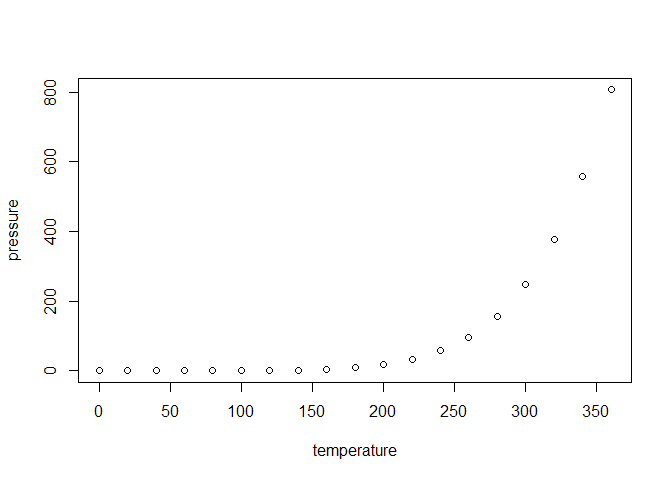

<!-- README.md is generated from README.Rmd. Please edit that file -->

# pendata

<!-- badges: start -->
<!-- badges: end -->

Pension data for the Reason-Rockefeller pension policy analysis tool.

## Installation

You can install the development version of pendata from
[GitHub](https://github.com/) with:

``` r
# install.packages("devtools")
devtools::install_github("donboyd5/pendata")
```

This package contains pension-related data:

- **Commonly used actuarial tables** from authoritative sources, such as
  the Society of Actuaries’ (SOA) MP-2018 mortality improvement scale.

- **System-specific data**. The package includes mortality tables and
  other data specific to the Florida Retirement System (FRS). We will
  add data from additional plans. The package takes raw data from
  individual pension systems in formats that vary from system to system,
  and converts it to a consistent format that is consistent from system
  to system. For example, mortality tables follow a common format and
  are consistent with the format used for SOA tables.

The package also includes tools to convert data from the package’s
formats to selected other formats.

The goal of pendata is to …

## Installation

You can install the development version of pendata from
[GitHub](https://github.com/) with:

``` r
# install.packages("devtools")
devtools::install_github("donboyd5/pendata")
```

## Example

This is a basic example which shows you how to solve a common problem:

``` r
library(pendata)
## basic example code
```

What is special about using `README.Rmd` instead of just `README.md`?
You can include R chunks like so:

``` r
summary(cars)
#>      speed           dist       
#>  Min.   : 4.0   Min.   :  2.00  
#>  1st Qu.:12.0   1st Qu.: 26.00  
#>  Median :15.0   Median : 36.00  
#>  Mean   :15.4   Mean   : 42.98  
#>  3rd Qu.:19.0   3rd Qu.: 56.00  
#>  Max.   :25.0   Max.   :120.00
```

You’ll still need to render `README.Rmd` regularly, to keep `README.md`
up-to-date. `devtools::build_readme()` is handy for this.

You can also embed plots, for example:



In that case, don’t forget to commit and push the resulting figure
files, so they display on GitHub and CRAN.
